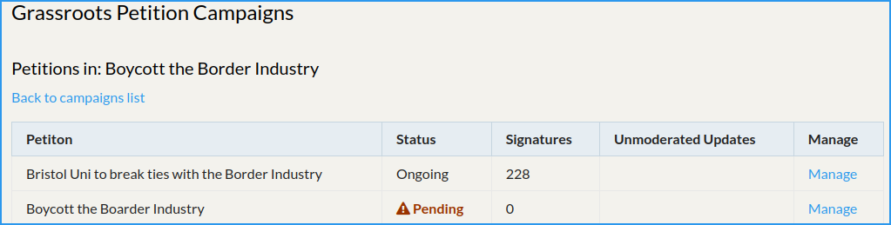

## Lifecycle of a petition.

1. Campaigner: creates a petition

2. Staff: moderate and publish the petition

3. Public: sign the petition

4. Campaigner: updates the petition

5. Staff: keep eye on content

6. Campaigner/Staff: close off completed/abandoned petitions.

## Creating a petition.

Assuming you got everything installed OK, and that your website is at
example.org, visiting `https://example.org/petitions/` should show see
a list of petitions.  You should have an option to **create a petition**.

This will ask you your name and email. Completing this form will send you
an email with a one-time link that authorises you as someone who can
create petitions.

Follow the link and you'll now see a list of campaigns that you can create
a petition for. Choose a campaign.

Complete the form.

In the bigger text boxes you can use MarkDown
([CommonMark](https://commonmark.org/help/)) format. This can be a good
way to make your text more readable and accessible (e.g. numbered/bulleted
lists, **strong emphasis** and links etc.)

Take care writing the "What" text - this is what people will be putting
their names to and because of that it can't be changed later.

You can upload an image. Landscape is going to work best. You **must**
supply alt text for images, so that non-visual users do not miss out.

Hit Save.

The petition will show to you as "Waiting on moderation".

## Staff: moderate and publish petitions

If a campaign is configured to do so, an email will be sent when anyone
creates a new petition for that campaign, with a reminder to check for
petitions pending moderation.

Staff can log in to CiviCRM and then visit **Cases » Grassroots
Petitions**

In the screenshot below you can see there are 4 petitions needing
moderation, 2 in *Boycott the Border Industry*, and 2 in *Fossil Free
Careers*.

Clicking on the petitions link for a campaign will list its petitions,
e.g.

The **Manage** link will take you through to the Case Management screen
for this petition.

From there you can modify the status from Pending to Ongoing, after
checking the content makes sense.

The petition is now live!

## Public: signing the petition

This is as simple as filling in the form. Note that it will take 10s or so
to 'sign' the petition. This is very effective against spam attacks. Many
popular campaign sites (naming no names, but some of the big ones!) don't
have any spam protection and get a lot of suspect signups. Others insist
that you help Google identify traffic lights, which is annoying (and often
breaks with adblocker and privacy protection extensions).

### Signup, consent, thank yous.

If they consent, they will

- have a comms preference update activity added, if the GDPR extension is
  installed.

- be added to group 62! Currently this is not configurable!

- be added to a group with the name `consent_all_email` and, if they gave
  a phone, to `consent_all_phone` - again, not configurable.

- be send the configured welcome email. (this is the same email for all
  campaigns and petitions)

## Campaigner: updates the petition

The campaigner can go back in to edit their petitions. It's a little
confusing but they will need to click the **Create your own petition**
link as they did before, and enter their name and email.

This will send them a new admin link, but this will list all petitions
they have set up, allowing them to edit those as well as create new ones.

They can edit some of the texts on the petition, and they can provide
update texts with images, e.g. when key moments of the campaign happen.

Updates are immediately live, but are flagged for staff to check in on.

## Staff: keep eye on content

Staff can visit the **Cases » Grassroots Petitions** list, click to see
all the petitions for a campaign, and see petitions that have un-checked
updates. They can edit or delete those updates if they are inappropriate.

## Campaigner/Staff: close off completed/abandoned petitions.

Staff: by editing the case via the case management screen.

Campaigners: by logging in (Create New petition...) and choosing to
update/close their petitions.

